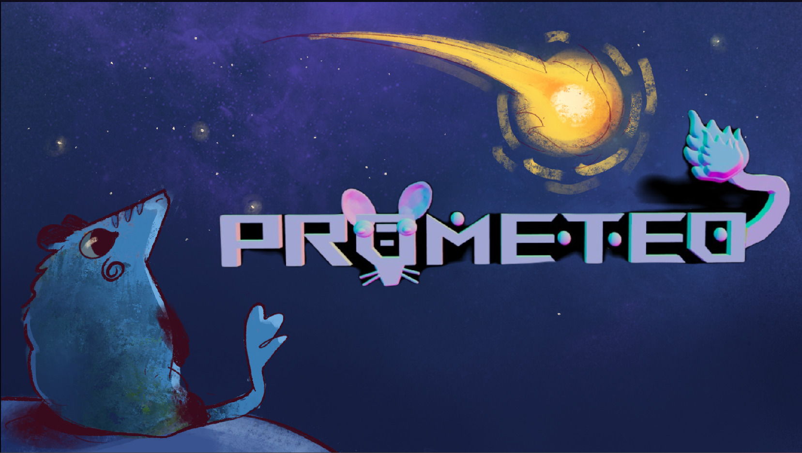
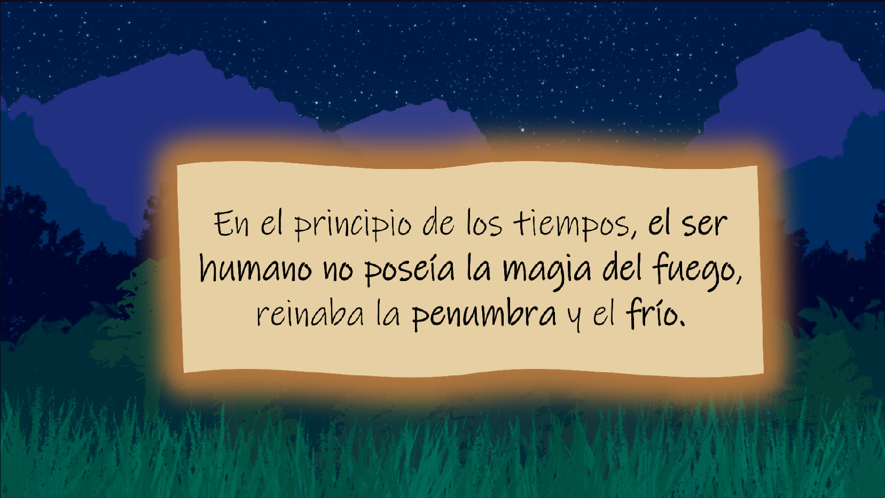
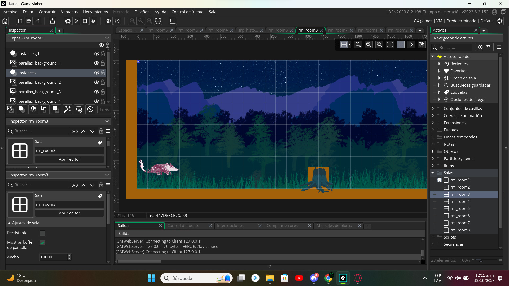
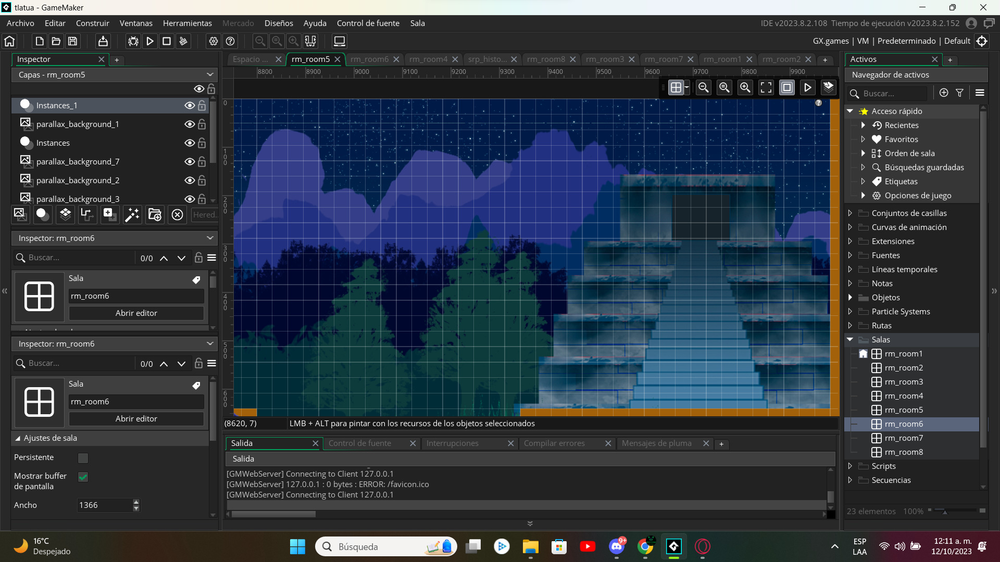
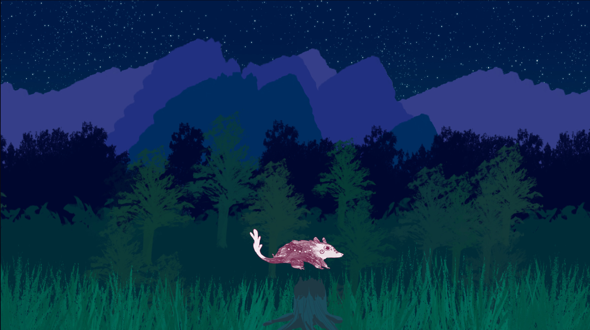
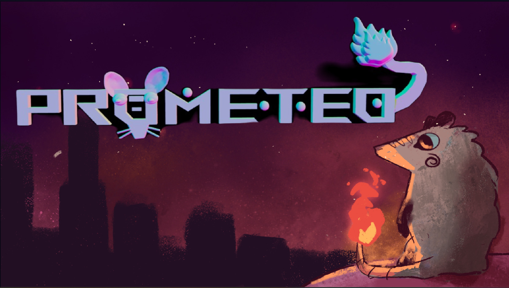

# Prometeo_Tlacuache

Este repositorio corresponde a un videojuego en 2D que fue creado durante la Woman Game Jam 2023. El concepto central del juego es guiar a un tlacuache, haciendo referencia a la historia de Prometeo.

# Capturas de pantalla

# Como ejecutar la aplicacion

1. Descargar el repositorio
2. Descargar en seccion de recursos "Sprites"
3. Agregar la carpeta "Sprites" descomprimida en la carpeta de "Prometeo_Tlacuache"
4. Abrir el archivo "Prometeo_Tlacuache.yyp"
5. Ejecutar la aplicación dentro de Game Maker

# Autores

[Aquiles Piña Olvera - Lic. Ciencias de la informática IPN](https://github.com/Aquilespina)

[Josmar Palomino Castelan - Lic Ciencias de la informática IPN ](https://github.com/Josmar360)

# Recursos

[Carpeta de Sprites](https://drive.google.com/drive/folders/1b7gmFzkynIlZUO_SVxbBXxQCaalqfiGc?usp=sharing)
